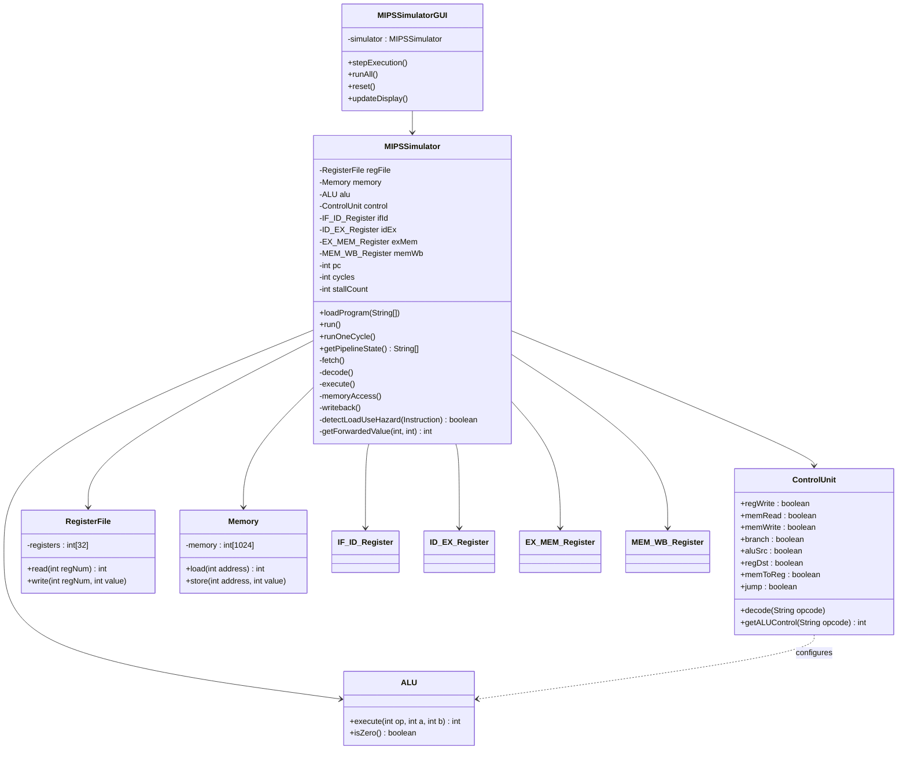

<div align="center">

# 🖥️ MIPS Pipeline Simulator

### A cycle-accurate, 5-stage MIPS pipeline simulator with hazard detection, data forwarding, and an interactive GUI

[](https://openjdk.org/)
[](LICENSE)
[](.)
[](.)
[](.)

<br/>

> **Educational simulator** that faithfully models the classical 5-stage MIPS pipeline,  
> complete with **data/control hazard resolution**, **register forwarding**, and real-time visualization.

</div>

---

## 📋 Table of Contents

- [Overview](#-overview)
- [Pipeline Architecture](#-pipeline-architecture)
- [Hazard Detection & Resolution](#-hazard-detection--resolution)
- [Supported Instructions](#-supported-instructions)
- [Project Structure](#-project-structure)
- [Class Architecture](#-class-architecture)
- [Quick Start](#-quick-start)
- [Example Programs](#-example-programs)
- [GUI Interface](#-gui-interface)
- [Technical Deep Dive](#-technical-deep-dive)
- [Author](#-author)

---

## 🔍 Overview

The **MIPS Pipeline Simulator** is a Java application that emulates the inner workings of a 5-stage MIPS processor pipeline at the **cycle-by-cycle** level. It is designed as an educational tool to help students and developers understand:

- How instructions flow through pipeline stages simultaneously
- How data hazards arise and are resolved through **stalling** and **forwarding**
- How control hazards (branches and jumps) cause pipeline flushes
- How pipeline registers hold state between stages each clock cycle

The simulator includes **both** a headless console mode for scripted test runs and a **Java Swing GUI** for interactive, visual step-by-step debugging.

---

## 🏗️ Pipeline Architecture

The simulator implements the classic **5-stage MIPS pipeline**:

```
 ┌──────┐    ┌──────┐    ┌──────┐    ┌──────┐    ┌──────┐
 │  IF  │───▶│  ID  │───▶│  EX  │───▶│ MEM  │───▶│  WB  │
 └──────┘    └──────┘    └──────┘    └──────┘    └──────┘
 Instruction  Instruction  Execute   Memory      Write
   Fetch      Decode                 Access      Back

 IF/ID Reg   ID/EX Reg   EX/MEM Reg  MEM/WB Reg
 ──────────  ──────────  ──────────  ──────────
 instruction instruction aluResult   aluResult
 pc          readData1   readData2   memData
             readData2   writeReg    writeReg
             immediate   zero
             control sigs branchTarget
```

### Stage Descriptions

| Stage | Name | Responsibility |
|-------|------|---------------|
| **IF** | Instruction Fetch | Reads the next instruction from instruction memory using the Program Counter (PC) |
| **ID** | Instruction Decode | Decodes the opcode, reads source registers from the Register File, generates control signals via the Control Unit, detects load-use hazards |
| **EX** | Execute | ALU performs the arithmetic/logic operation; forwarding is applied here; branches and jumps update the PC and flush the pipeline |
| **MEM** | Memory Access | Loads data from or stores data to data memory (4 KB); passes ALU result and memory data to the next register |
| **WB** | Write Back | Writes the final result (ALU result or memory load) back into the register file |

### Pipeline Registers

Each pair of adjacent stages is connected by a **pipeline register** that latches the output of one stage as input to the next. This allows all five stages to operate in parallel on different instructions each cycle.

| Register | Fields Stored |
|----------|--------------|
| `IF_ID_Register` | `instruction`, `pc` |
| `ID_EX_Register` | `instruction`, `pc`, `readData1`, `readData2`, `immediate`, `rs`, `rt`, `rd`, plus all control signals |
| `EX_MEM_Register` | `instruction`, `aluResult`, `readData2`, `writeRegister`, `zero`, `branchTarget` |
| `MEM_WB_Register` | `instruction`, `aluResult`, `memData`, `writeRegister` |

> **Why reverse-order execution?**  
> Stages are executed **WB → MEM → EX → ID → IF** each cycle in code so that each stage reads the pipeline register written by the previous cycle's upstream stage — preventing one cycle from both consuming and producing data in the same register incorrectly.

---

## ⚠️ Hazard Detection & Resolution

Hazards are situations where the correct execution of an instruction depends on data or actions not yet completed by a previous instruction. The simulator handles **three** categories:

### 1. 🔴 Data Hazards — RAW (Read After Write)

A **RAW hazard** occurs when an instruction tries to read a register that a preceding instruction hasn't written back yet.

```
Example:
  ADDI $1, $0, 10    ← writes $1 in WB
  ADD  $3, $1, $2    ← reads $1 in ID  ← HAZARD! $1 not yet committed
```

**Resolution: Forwarding (Bypassing)**

Instead of waiting for WB, forwarding paths short-circuit the result directly from an earlier pipeline register into the EX stage:

```
 EX/MEM ──────────────────────────────────▶ EX (EX-to-EX forwarding)
  MEM/WB ─────────────────────────────────▶ EX (MEM-to-EX forwarding)
```

- **EX-to-EX forwarding** — forwards the ALU result one stage back (highest priority)
- **MEM-to-EX forwarding** — forwards the data from the MEM/WB pipeline register

> ⚡ Forwarding eliminates stalls for most RAW hazards without any performance penalty.

### 2. 🟡 Load-Use Hazards

A special case of RAW: a `LW` instruction cannot forward its result until **after** the MEM stage, but the next instruction needs it at the **start** of EX — one cycle too early.

```
Example:
  LW   $5, 0($0)    ← loads from memory, result available after MEM
  ADD  $6, $5, $1   ← needs $5 at start of EX — one cycle too early!
```

**Resolution: Pipeline Stall (Bubble Insertion)**

When a load-use hazard is detected in the **ID stage**:
1. The `ID/EX` register is cleared → a **bubble** (NOP) is inserted into the pipeline
2. The PC is decremented back → the stalled instruction is re-fetched next cycle
3. `stallCount` is incremented for performance tracking

```
Cycle N:   LW   [EX]  →  ADD  [ID]  ← HAZARD DETECTED
Cycle N+1: LW   [MEM] →  NOP  [EX]  ← bubble inserted
Cycle N+2: LW   [WB]  →  ADD  [EX]  ← forwarding now resolves the value
```

### 3. 🔵 Control Hazards (Branch/Jump)

When a **branch** or **jump** is taken, the instruction fetched immediately after is wrong because the PC should have gone to the branch target.

**Supported control instructions:**

| Instruction | Type | Condition |
|-------------|------|-----------|
| `BEQ` | Conditional | Branch if `rs == rt` (ALU zero flag) |
| `BGEZ` | Conditional | Branch if `rs >= 0` |
| `J` | Unconditional | Always jumps to target address |

**Resolution: Pipeline Flush**

Branch/jump outcomes are resolved in the **EX stage**. When a branch is taken:
1. The PC is updated to the branch/jump target
2. The `IF/ID` register is cleared → the wrongly-fetched instruction is discarded
3. A **1-cycle penalty** is incurred

```
Cycle N:   BEQ  [EX]   decide = taken → flush IF/ID!
Cycle N+1: ---  [MEM]  bubble (flushed instruction discarded)
Cycle N+1: target[IF]  correct instruction now fetched
```

---

## 📚 Supported Instructions

### R-Type Instructions
> Operate entirely on registers. Format: `OP $rd, $rs, $rt`

| Instruction | Operation | Description |
|-------------|-----------|-------------|
| `ADD` | `$rd = $rs + $rt` | Integer addition |
| `SUB` | `$rd = $rs - $rt` | Integer subtraction |
| `AND` | `$rd = $rs & $rt` | Bitwise AND |
| `OR` | `$rd = $rs \| $rt` | Bitwise OR |
| `XOR` | `$rd = $rs ^ $rt` | Bitwise XOR |
| `SLT` | `$rd = ($rs < $rt) ? 1 : 0` | Set Less Than |
| `SLL` | `$rd = $rt << shamt` | Shift Left Logical |
| `SRL` | `$rd = $rt >> shamt` | Shift Right Logical |

### I-Type Instructions
> Use an immediate (constant) value. Format: `OP $rt, $rs, imm` or `OP $rt, imm($rs)`

| Instruction | Operation | Description |
|-------------|-----------|-------------|
| `ADDI` | `$rt = $rs + imm` | Add immediate |
| `ORI` | `$rt = $rs \| imm` | OR immediate |
| `LW` | `$rt = MEM[$rs + imm]` | Load word from memory |
| `SW` | `MEM[$rs + imm] = $rt` | Store word to memory |
| `BEQ` | `if $rs == $rt: PC = PC+1+imm` | Branch if equal |
| `BGEZ` | `if $rs >= 0: PC = PC+1+imm` | Branch if >= zero |

### J-Type Instructions
> Unconditional control flow.

| Instruction | Operation | Description |
|-------------|-----------|-------------|
| `J` | `PC = address` | Jump to absolute address |

---

## 📁 Project Structure

```
MIPS_Pipeline_Simulator/
│
├── 📄 README.md                   ← You are here
├── 📄 class_diagram.md            ← Mermaid class diagram
├── 📄 documentatie_overleaf.txt   ← LaTeX project documentation
│
└── 📂 src/
    │
    ├── 🧠 Core Simulator
    │   ├── MIPSSimulator.java      ← Main engine: pipeline stages, hazards, forwarding
    │   └── MIPSTest.java           ← Console test suite with multiple scenarios
    │
    ├── 🖼️  GUI
    │   └── MIPSSimulatorGUI.java   ← Swing GUI: dark theme, tables, step/run modes
    │
    ├── ⚙️  Hardware Components
    │   ├── ALU.java                ← Arithmetic Logic Unit (ADD/SUB/AND/OR/XOR/SLT/SLL/SRL)
    │   ├── ControlUnit.java        ← Decodes opcode → control signals
    │   ├── RegisterFile.java       ← 32 × 32-bit MIPS registers ($0–$31)
    │   └── Memory.java             ← 4 KB word-addressed data memory
    │
    ├── 📦 Instruction Handling
    │   ├── Instruction.java        ← Instruction data model (opcode, rs, rt, rd, imm, shamt)
    │   └── InstructionParser.java  ← Parses MIPS assembly text → Instruction objects
    │
    └── 🔗 Pipeline Registers
        ├── IF_ID_Register.java     ← Latch between Fetch and Decode stages
        ├── ID_EX_Register.java     ← Latch between Decode and Execute stages
        ├── EX_MEM_Register.java    ← Latch between Execute and Memory stages
        └── MEM_WB_Register.java    ← Latch between Memory and Write-Back stages
```

---

## 🧩 Class Architecture



---

## 🚀 Quick Start

### Prerequisites

- **Java 8+** (JDK required for compilation)

### 1. Compile

```bash
cd src
javac *.java
```

### 2. Launch the GUI (Recommended)

```bash
java MIPSSimulatorGUI
```

### 3. Run Console Tests

```bash
java MIPSTest
```

> The test suite runs multiple pre-defined programs covering forwarding, stalls, branches, and jumps — and prints a detailed cycle-by-cycle trace.

---

## 💡 Example Programs

### Example 1 — Data Hazards with Forwarding

```assembly
# EX-to-EX forwarding: ADD reads $1 and $2 before they are written back
ADDI $1, $0, 10      # $1 = 10
ADDI $2, $0, 20      # $2 = 20
ADD  $3, $1, $2      # $3 = 30  ← forwarded from EX/MEM
SUB  $4, $3, $1      # $4 = 20  ← forwarded from MEM/WB
```

### Example 2 — Load-Use Hazard (Stall Required)

```assembly
# One pipeline stall is inserted between LW and ADD
SW   $3, 0($0)       # MEM[0] = $3
LW   $5, 0($0)       # $5 = MEM[0]   ← triggers load-use detection
ADD  $6, $5, $1      # $6 = $5 + $1  ← stall inserted before this executes
```

### Example 3 — Control Hazard (Branch)

```assembly
ADDI $1, $0, 5
ADDI $2, $0, 5
BEQ  $1, $2, 2       # branch taken → jump +2 instructions
ADDI $3, $0, 99      # ← FLUSHED (never executes)
ADDI $3, $0, 99      # ← FLUSHED (never executes)
ADDI $4, $0, 42      # ← first instruction at branch target
```

### Example 4 — Unconditional Jump

```assembly
ADDI $1, $0, 1
J    3               # jump to instruction index 3
ADDI $2, $0, 99      # ← FLUSHED
ADDI $3, $0, 77      # ← FLUSHED
ADDI $4, $0, 42      # ← execution resumes here
```

---

## 🖼️ GUI Interface

The graphical interface is built with **Java Swing** and features:

| Panel | Description |
|-------|-------------|
| **Program Input** | Text area where you type MIPS assembly; supports `#` line comments |
| **Pipeline Stages** | Live color-coded display of which instruction occupies each stage (IF / ID / EX / MEM / WB) |
| **Register Table** | Shows all 32 registers with values in both **decimal** and **hex** |
| **Memory Table** | Shows data memory contents |
| **Execution Log** | Scrolling log of every cycle event: fetches, stalls, forwards, branches |
| **Controls** | **Load**, **Step** (one cycle), **Run All** (until halt), **Reset** |

> The GUI uses a **dark theme** with high-contrast colours to make pipeline stages immediately distinguishable.

---

## 🔬 Technical Deep Dive

### Forwarding Logic

```
          ┌──────────────────────────────────┐
          │           EX Stage               │
          │  forwardedData1 = getForward($rs)│
          │  forwardedData2 = getForward($rt)│
          └──────────────────────────────────┘
                  ▲                  ▲
    EX-to-EX ────┘ (priority 1)     │
    MEM-to-EX ──────────────────────┘ (priority 2)
```

Priority rules implemented in `getForwardedValue()`:
1. **EX-to-EX** (from `EX_MEM` register) — checked first, highest priority
2. **MEM-to-EX** (from saved `MEM_WB` register) — used if EX-to-EX doesn't apply
3. Original register value — no forwarding needed

> ⚠️ The `MEM_WB` register is **saved before** the MEM stage runs each cycle, because MEM executes before EX in the reverse-order stage loop. This ensures the forwarding path uses the correct value from the *previous* cycle's MEM/WB.

### Stall (Bubble) Insertion

Implemented in the **ID stage** via `detectLoadUseHazard()`:

```java
// Pseudo-code
if (idEx.instruction == LW && idEx.rt matches (currentInstr.rs or currentInstr.rt)) {
    idEx.clear();     // insert bubble
    pc--;             // re-fetch stalled instruction next cycle
    stallCount++;
}
```

### Branch Resolution

Branches are resolved in the **EX stage** (not ID), meaning exactly **one** wrongly-fetched instruction must always be flushed when a branch is taken:

```java
if (BEQ && alu.zero)  { pc = branchTarget; ifId.clear(); }
if (BGEZ && rs >= 0)  { pc = branchTarget; ifId.clear(); }
if (J)                { pc = jumpTarget;   ifId.clear(); }
```

### Control Signals (generated by `ControlUnit`)

| Signal | R-Type | ADDI/ORI | LW | SW | BEQ/BGEZ | J |
|--------|--------|----------|----|----|---------|---|
| `regWrite` | ✅ | ✅ | ✅ | ❌ | ❌ | ❌ |
| `memRead` | ❌ | ❌ | ✅ | ❌ | ❌ | ❌ |
| `memWrite` | ❌ | ❌ | ❌ | ✅ | ❌ | ❌ |
| `branch` | ❌ | ❌ | ❌ | ❌ | ✅ | ❌ |
| `jump` | ❌ | ❌ | ❌ | ❌ | ❌ | ✅ |
| `aluSrc` | ❌ | ✅ | ✅ | ✅ | ❌ | ❌ |
| `regDst` | ✅ | ❌ | ❌ | ❌ | ❌ | ❌ |
| `memToReg` | ❌ | ❌ | ✅ | ❌ | ❌ | ❌ |

> Control signals are **saved into the `ID_EX` pipeline register** during decode and propagated forward — this prevents the common bug of reading stale control signals from the `ControlUnit` object during later stages.

---

## 👤 Author

**Teodor Șuteu**  
Technical University of Cluj-Napoca  
Faculty of Automation and Computer Science  

---

<div align="center">

*Built as an educational project for the Computer Systems Architecture course.*  
*Cycle-accurate • Hazard-aware • Forwarding-enabled*

</div>
